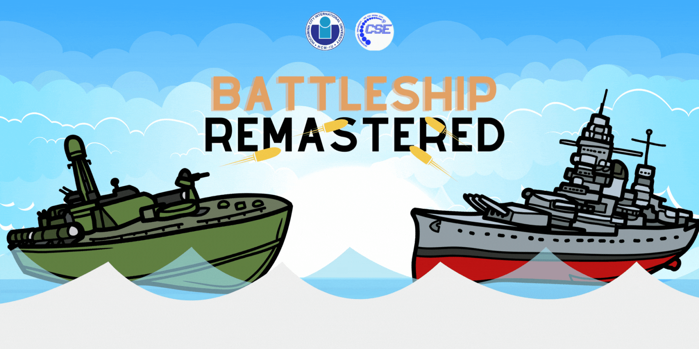
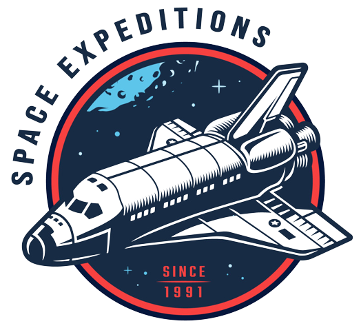
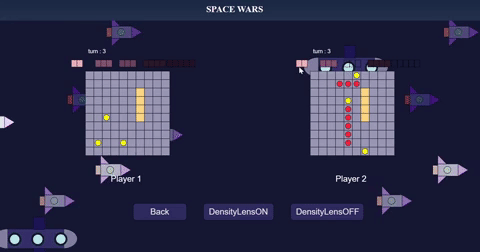
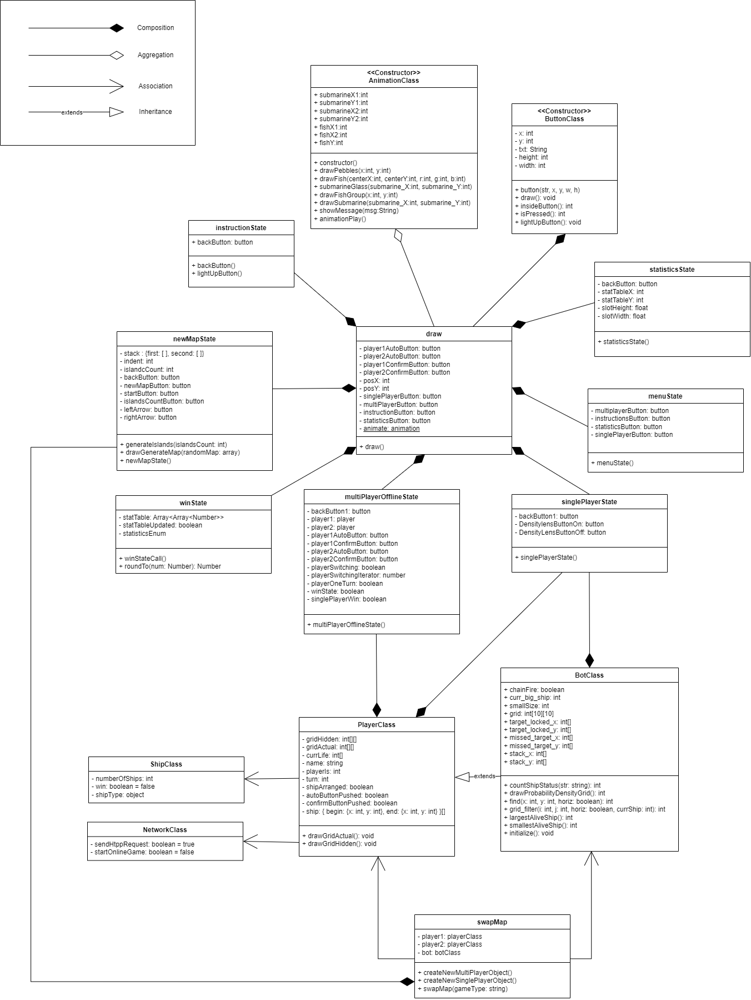
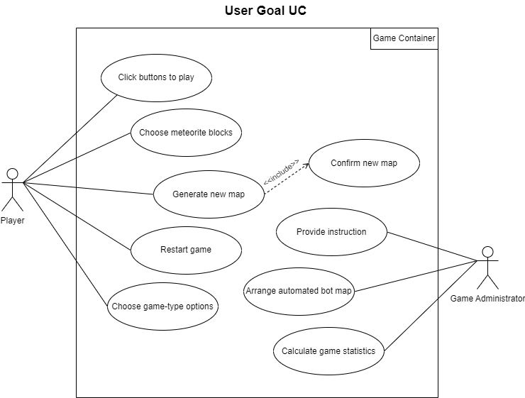
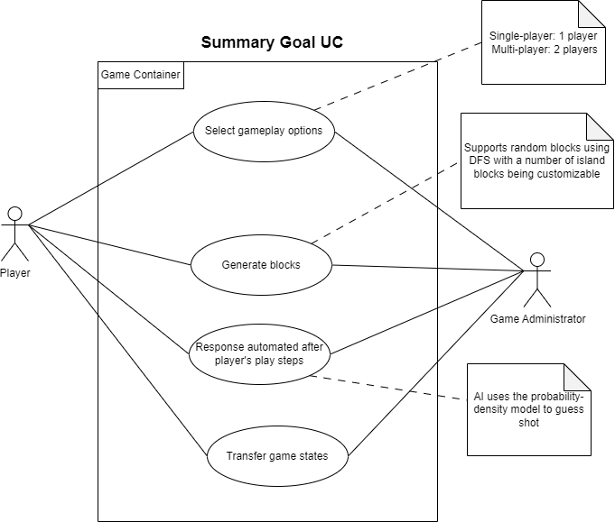
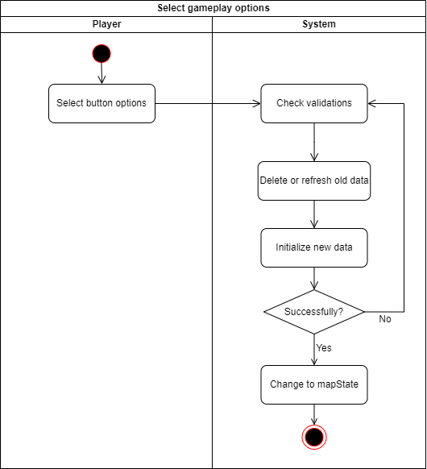
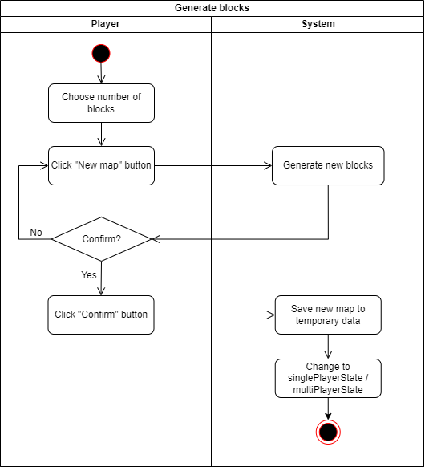
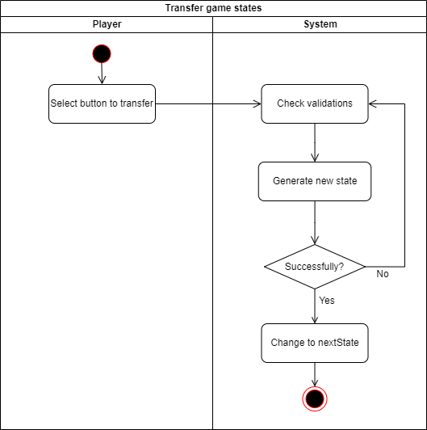
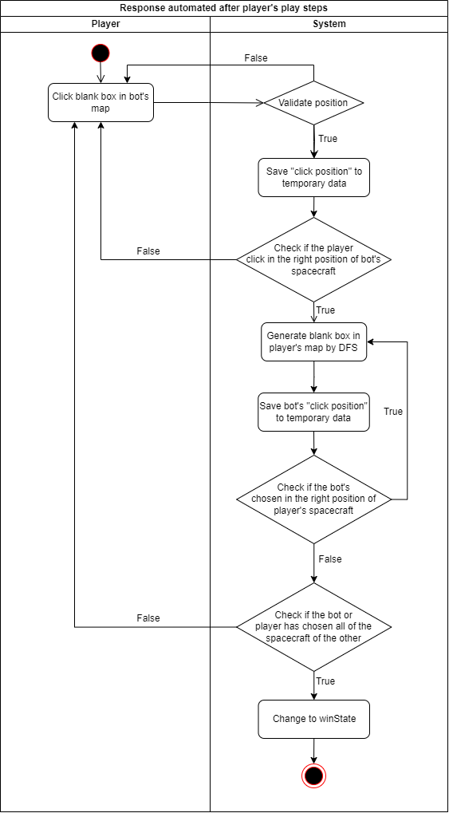

<div id="top" align ="center">

</div>

<div align="center">

[![Contributors][contributors-shield]][contributors-url]
[![Forks][forks-shield]][forks-url]
[![Stargazers][stars-shield]][stars-url]
[![Issues][issues-shield]][issues-url]

</div>

<!-- PROJECT LOGO -->
<br />
<div align="center">
  <a href="https://github.com/congbangitiu/Battleship-Remastered.git">
    
</a>

<h3 align="center">ALGORITHM & DATA STRUCTURES</h3>
<h4 align="center">Team Name: JOSEPH</h4>

  <p align="center">
    An online game created with HTML, CSS, Javascript and p5.js for Algorithm & Data Structures course in International University - VNUHCM!
    <br />
    <br />
    <!-- <a href="https://youtu.be/iLo5E-07aY0">View Demo</a> -->
  </p>
</div>

<!-- TABLE OF CONTENTS -->

# Table of contents :round_pushpin:

1. [Introduction](#Introduction)
2. [Techniques](#Techniques)
3. [Charts](#Charts)
4. [Features](#Features)
5. [Challenges](#Challenges)
6. [Acknowledgments](#Acknowledgments)
7. [References](#References)

## Introduction <a name="Introduction"></a> :bricks:

<div align="center">

</div>

<div style="text-align:justify">

We took an Algorithm & Data Structures course and the final project was creating a Battleship game. It was challenging
but also incredibly fun! We had to implement different algorithms for generating ships and randomizing their placement
on a grid, along with logic that could handle both human and computer input. That was just the tip of the iceberg
though - we also had to handle game states and error checking, all while optimizing for speed and efficiency. One thing
I loved about this project was how it brought together everything we learned throughout the course - from different data
structures like linked lists to more advanced algorithms like minimax. Plus, getting to play against friends (or the
computer) once we finished coding made all the hard work completely worth it!

</div>

### Team Members :couplekiss_man_man:

| Order |         Name          |     ID      |            Email            |                 Github account                  |                            
|:-----:|:---------------------:|:-----------:|:---------------------------:|:-----------------------------------------------:|
|   1   | Nguyen Luan Cong Bang | ITITIU20163 | bangnguyen.071102@gmail.com | [congbangitiu](https://github.com/congbangitiu) |          
|   2   |     Pham Minh Vu      | ITDSIU20354 |     pmvu.ityu@gmail.com     |      [PMinhVu](https://github.com/PMinhVu)      |
|   3   |   Nguyen Quang Dieu   | ITDSIU20031 |     dieu5084@gmail.com      |   [itzmealvin](https://github.com/itzmealvin)   |                            
|   4   |  Nguyen Hoang Anh Tu  | ITDSIU20090 |     nghganhtu@gmail.com     |    [nghganhtu](https://github.com/nghganhtu)    |                            
|   5   |     Dang Nhat Huy     | ITITIU20043 |    dnhuy.ityu@gmail.com     |  [Nhathuy1305](https://github.com/Nhathuy1305)  |                            

### Installation :dart:

1. Open the terminal on your IDE
2. Clone the repo
   ```sh
   git clone https://github.com/congbangitiu/Battleship-Remastered.git
   ```
3. Check the file status
   ```sh
   git status
   ```
4. Change branch
   ```sh
   git checkout 'branch_name'
   ```

### Motivation :mechanical_arm:

<div style="text-align:justify">

Motivation is what drives us to succeed in life, and when it comes to computer science, algorithms & data structures
provide the necessary tools to achieve that success. The classic game of Battleship relies heavily on these concepts as
players must efficiently search through a grid of potential targets while maximizing their chances of hitting the
opponent's ships. Optimization is key in this game, as slow searching can mean the difference between victory and
defeat. This is where algorithms come into play - by implementing sophisticated searching techniques such as binary
search or A* search, players can quickly traverse the board and locate enemy ships with minimal effort. Likewise, data
structures like hash tables assist in storing player moves for easy retrieval later on. In combining these methods with
strategic planning and intuition, players can become masters of modern-day Battleship strategy.

</div>

### Task Allocation :ok_man:

| Order | Task                                                              |  Assignee  | Contribution |
|:------|:------------------------------------------------------------------|:----------:|:------------:|
| 1     | Player class, Menu state, Project Management                      | Cong Bang  |     20%      |
| 2     | Multi-player State, Single player state, Statistics state         |  Minh Vu   |     20%      |
| 3     | New map state, Win state calling, Finding assets                  | Quang Dieu |     20%      |
| 4     | Animation class, Button class, Ship class, Sketch, Draw, Swap map |   Anh Tu   |     20%      |
| 5     | Github Management, Bot class, Instruction state                   |  Nhat Huy  |     20%      |

<br />

## Techniques <a name="Techniques"></a>:joystick:

- Language: [JavaScript](https://www.javascript.com)
- Library: [p5.js](https://p5js.org)

<br />


<!-- FEATURES -->

## Features <a name="Features"></a>:joystick:
### 1. Class Diagram
<div align="center">
    
</div>
<br />
  
### 2. Use Case Diagram
#### a. User Goals Use Case
<div align="center">
    
</div>

#### b. Summary Goals Use Case
<div align="center">
    
</div>
<br />

### 3. Activity Diagram
#### a. Select gameplay options
<div align="center">
    
</div>

#### b. Generate blocks
<div align="center">
    
</div>

#### c. Transfer game states
<div align="center">
    
</div>

#### d. Response automated after player's play steps
<div align="center">
    
</div>

<!-- CHALLENGES -->

## Challenges<a name="Challenges">:bangbang:

- Task allocation for each team member
- Time management
- Using platform for communication (Drive, Trello)
- Working environment (Github)
  <br />

## Acknowledgments<a name="Acknowledgments">:brain:

<div style="text-align:justify">

We would want to express our gratitude to Dr. Tran Thanh Tung for providing us with the chance to participate in this
project and apply what we learned in theory into practice. This project's learning curve was steep, but it was well
worth it for all of us. We have learned more about interface technologies to construct a functioning application that
interacts with our project. Sir, we want to thank you again for all the hard work and expertise that you have put into
your teaching. We'll make sure that all we've learned doesn't go to waste, and that we can master them better from now
on :heart:

</div>

<br />

## References<a name="References">  :eye::tongue::eye:

1. [danielrzhang](https://github.com/danielrzhang/Tank-Buster.git)
2. [veykos](https://github.com/veykos/Battleships.git)
3. [abdullahjamal1](https://github.com/abdullahjamal1/battleshipBoardGame.git)
4. [Janekk](https://github.com/Janekk/Battleships.git)
5. [billmei](https://github.com/billmei/battleboat.git)

<br />

<p align="right"><a href="#top">Back to top ↑</a></p>

<!-- MARKDOWN LINKS & IMAGES -->
<!-- https://www.markdownguide.org/basic-syntax/#reference-style-links -->

[contributors-shield]: https://img.shields.io/github/contributors/congbangitiu/Battleship-Remastered.svg?style=for-the-badge

[contributors-url]: https://github.com/congbangitiu/Battleship-Remastered/graphs/contributors

[forks-shield]: https://img.shields.io/github/forks/congbangitiu/Battleship-Remastered.svg?style=for-the-badge

[forks-url]: https://github.com/congbangitiu/Battleship-Remastered/network/members

[stars-shield]: https://img.shields.io/github/stars/congbangitiu/Battleship-Remastered.svg?style=for-the-badge

[stars-url]: https://github.com/congbangitiu/Battleship-Remastered/stargazers

[issues-shield]: https://img.shields.io/github/issues/congbangitiu/Battleship-Remastered.svg?style=for-the-badge

[issues-url]: https://github.com//congbangitiu/Battleship-Remastered/issues
